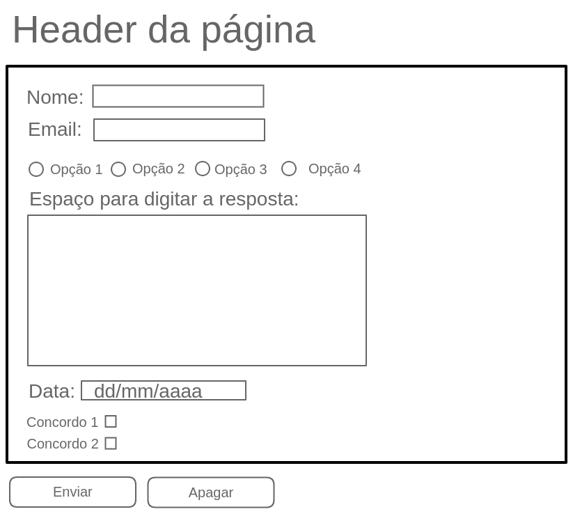

# Exercícios do Dia 6.1

### preventDefault - aplicando o conceito
- [x] Crie um arquivo HTML `index.html`.
- [x] Crie um arquivo Javascript `script.js`.
- [x] Em seu arquivo HTML:
    - Adicione o `<script src="script.js"></script>` no final do `body` do HTML.
    - Copie os três elementos abaixo (`a`, `input type="text"`, `checkbox`) em sua página
- [x] Em seu arquivo Javascript.
    - Adicione os seletores abaixo no começo do arquivo.

```
<!-- elemento para copiar -->
<a href="www.betrybe.com" target="_blank" id="href">TRYBE</a>
<input type="text" id="input-text"/>
<input type="checkbox" id="input-checkbox" />
```

```
// SELETORES
const INPUT_TEXT = document.querySelector("#input-text");
const INPUT_CHECKBOX = document.querySelector("#input-checkbox");
const HREF_LINK = document.querySelector("#href");
```

- [x] Adicione um evento `click` no elemento `a` que possui o id `href`. Na função do evento, implemente o método `.preventDefault()` para prevenir o comportamento padrão do elemento. Ou seja, ao clicar no link, nada deve acontecer.
- [x]  Adicione um evento `click` no elemento `checkbox` que possui o id `input-checkbox`. Na função do evento, implemente o método `.preventDefault()` para prevenir o comportamento padrão do elemento. Ou seja, ao clicar na caixinha, nada deve acontecer.
- [x]  Adicione um evento `keypress` no elemento `input type="text"` que possui o id `input-text`. Na função do evento, implemente o método `.preventDefault()` de forma que somente o caractere `a` (letra ‘a’ minúscula) possa ser digitado na caixinha. (*dica: para capturar a tecla digitada, utilize o `event.key` *)

### Form TrybeTrip


O formulário deverá permitir que a pessoa usuária insira os seguintes campos:
- [x] Nome Completo:
  - Limitado entre 10 e 40 caracteres.
- [x]E-mail:
  - Limitado entre 10 e 50 caracteres.
- [x] Destino Preferido:
  - 4 opções: Cidade, Campo, Praia, Montanhas.
- [x] Por que você deveria ser a pessoa desenvolvedora a ganhar o concurso TrybeTrip?
  - Limite de 500 caracteres.
- [x] Qual a melhor data para realizar sua viagem?
- [x] Gostaria de receber outras incríveis oportunidades oferecidas pela Trybe?
- [x] Concordo que imagens das minhas férias poderão ser usadas na divulgação de concursos futuros.

- [x] Crie um botão para enviar as informações preenchidas.

Agora vamos utilizar um pouco de javascript. Para isso, crie o arquivo script.js e o referencie no HTML.
>Dica: Coloque a tag <script> no final do seu body.

- [x] Interrompa o comportamento padrão do botão submit utilizando o método preventDefault().
- [x] Crie um botão que limpe as informações contidas nos campos.
- [x] (Bônus) A TrybeTrip precisa muito de fotos para divulgar seus concursos. Tendo isso em mente, faça com que somente quem autorizar o uso de imagens possa enviar suas informações.
- [x] (Bônus) Faça a validação dos campos com limite de caracteres. Caso não estejam dentro do esperado ao clicar no botão de submit, um alerta deve ser mostrado com a mensagem: ‘Dados Inválidos’. Caso contrário, a mensagem ‘Dados enviados com sucesso! Obrigado por participar do concurso TrybeTrip.’ deverá aparecer na tela.